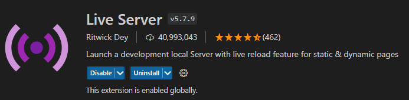
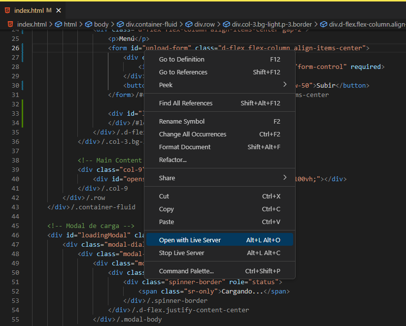

# JPG2000 Web Viewer - client

## Overview

This client-side application is part of the JPG2000 Web Viewer system. It is a single-page application designed to be simple and straightforward, relying on OpenSeadragon for rendering deep zoom images served by the FastAPI backend.

## Features

- Lightweight and easy to deploy.
- Utilizes OpenSeadragon for efficient, high-quality image viewing.
- Communicates with the FastAPI backend to fetch and display images.

## Prerequisites

- A modern web browser.
- A local or remote instance of the JPG2000 Web Viewer FastAPI server running and accessible.

## Setup

No installation is necessary. The client can be run on any static server, but for local development, it's recommended to use a tool like Live Server.

1. Clone the repository containing the client code.
2. Open the project folder in vscode.
3. Launch the application using Live Server or a similar static server solution.

   
   

## Using the Application

Once the application is running, it will connect to the JPG2000 Web Viewer FastAPI server to retrieve available images and display them using OpenSeadragon.

- Navigate to the provided local server URL (e.g., `http://127.0.0.1:5500` if using Live Server).
- Use the viewer to pan and zoom high-resolution images.

## Acknowledgments

- OpenSeadragon for providing the zoomable image viewer.
- FastAPI for the powerful and easy-to-use server framework.
